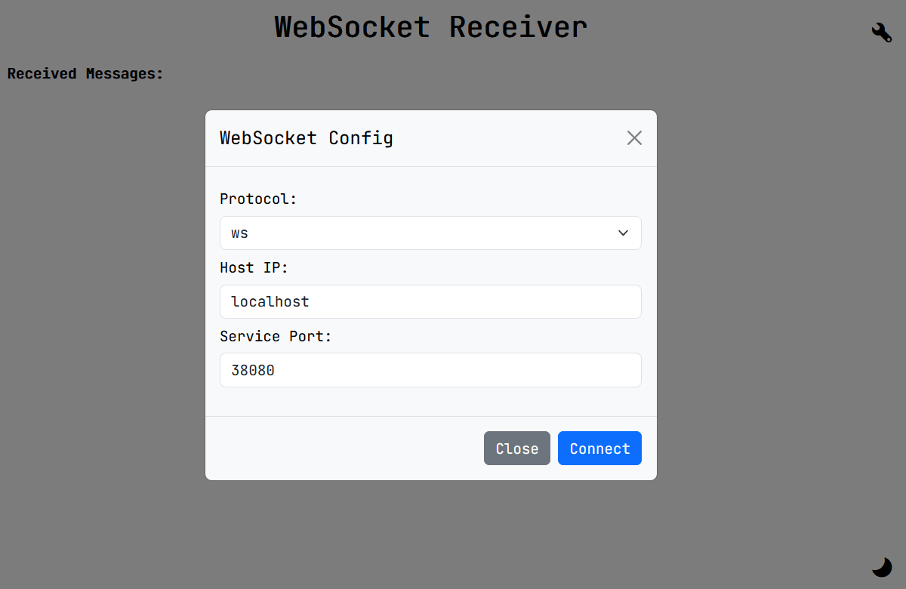

    <h2 align="center">WebSocket Receiver</h2>
    

        A WebSocket client to receive messages from a server using JavaScript and HTML.
         
         
        <a href="https://lab.yusux.xyz/WebSocket-Receiver">View Demo</a>
        ·
        <a href="https://github.com/Yusux/WebSocket-Receiver/issues">Report Bug</a>
        ·
        <a href="https://github.com/Yusux/WebSocket-Receiver/issues">Request Feature</a>
    

## About The Project

Since I found it difficult to find a good WebSocket client that only uses html and only receives messages, I implemented this. The main purpose is to implement a client for [Korabli-chatrans](https://github.com/Yusux/Korabli-chatrans).

### Built With

## Getting Started

The css and javascript files are in the css and js folders respectively. The html file is in the root folder named `index.html`. Just open the html file in a browser and you are good to go.

### Usage

1. Open the `index.html` file in a browser.
2. Click the config button on the top right corner to open the configuration modal.
3. Input the server address and port in the input fields.
4. Click the `Connect` button to connect to the server.
5. If the connection is successful, the modal will close after about 2 seconds and the messages will start to appear in the message box.

|Config Example|Receiving Example|
|:-:|:-:|
|||

## Contributing

Any contributions you make are **greatly appreciated**. You can fork the project and make a pull request. Also, you can open an issue if you find a bug or want to request a feature.

## License

Distributed under the MIT License. See `LICENSE` for more information.
